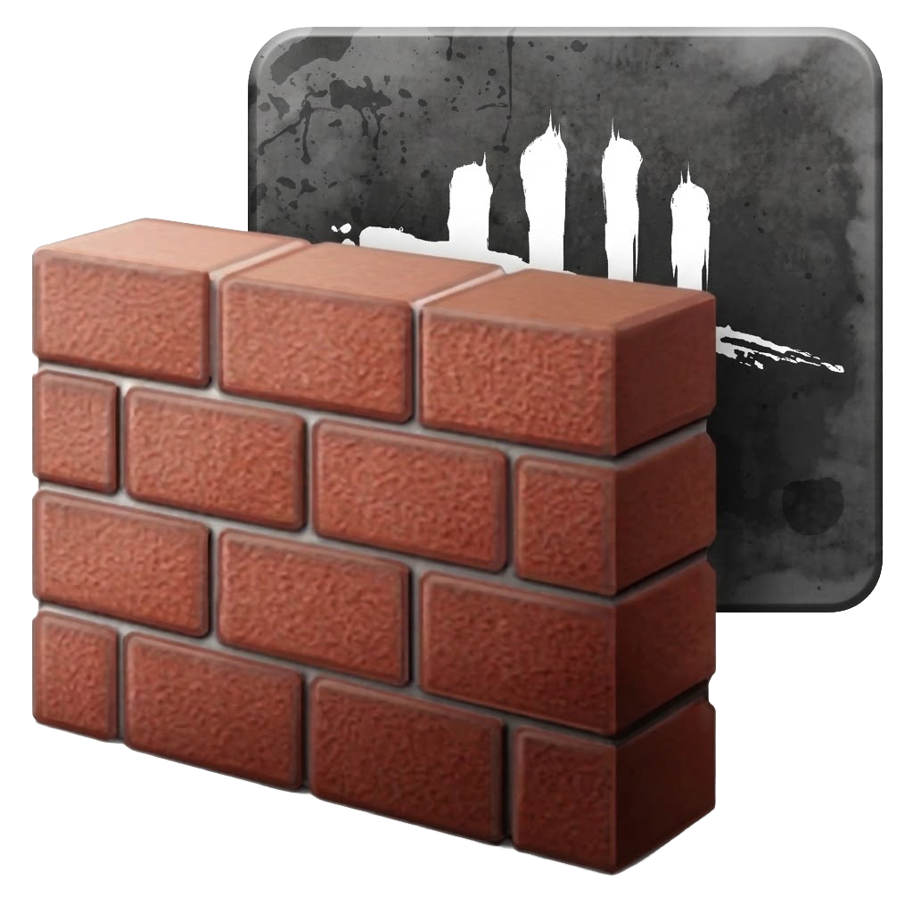

# DBD Server Blocker

A lightweight Windows app to control which AWS regions Dead by Daylight can connect to. Block or allow specific server regions using Windows Firewall rules scoped to the game executable — no impact on the rest of your network.

<p align="center">
  
</p>

## Features

- **Region blocking** — block/unblock individual AWS regions with one click
- **Exclusive mode** — allow only one region, automatically block all others
- **Permanent mode** — persist firewall rules across app restarts
- **Live ping** — see real-time latency to each region
- **Auto-update** — automatically fetches the latest AWS IP ranges on startup
- **System tray** — runs quietly in the background with tray controls
- **Lightweight** — targets only the DBD executable, no global firewall changes

## Download

Download the latest installer from the [Releases](../../releases) page and run it. The app will prompt for administrator privileges on launch (required for managing firewall rules).

## Supported Regions

| Region | Location | Region | Location |
|---|---|---|---|
| us-east-1 | Virginia | ap-south-1 | Mumbai |
| us-east-2 | Ohio | ap-east-1 | Hong Kong |
| us-west-1 | California | ap-northeast-1 | Tokyo |
| us-west-2 | Oregon | ap-northeast-2 | Seoul |
| ca-central-1 | Montreal | ap-southeast-1 | Singapore |
| eu-central-1 | Frankfurt | ap-southeast-2 | Sydney |
| eu-west-1 | Dublin | sa-east-1 | Sao Paulo |
| eu-west-2 | London | | |

## How It Works

The app fetches AWS IP ranges from the [official AWS endpoint](https://ip-ranges.amazonaws.com/ip-ranges.json), filters them by region, and creates outbound Windows Firewall rules targeting `DeadByDaylight-Win64-Shipping.exe`. Only traffic from the game is affected.

Rules are named `Block_DBD_{regionId}_{city}` (e.g. `Block_DBD_eu-west-1_Dublin`) for easy identification in Windows Firewall.

## Requirements

- Windows 10 / 11
- Administrator privileges

## Development

```bash
npm install
npm run dev       # start in dev mode
npm run build     # build (no packaging)
npm run dist      # build + package installer
```

Built with Electron, React, TypeScript, and Tailwind CSS.

## License

MIT
